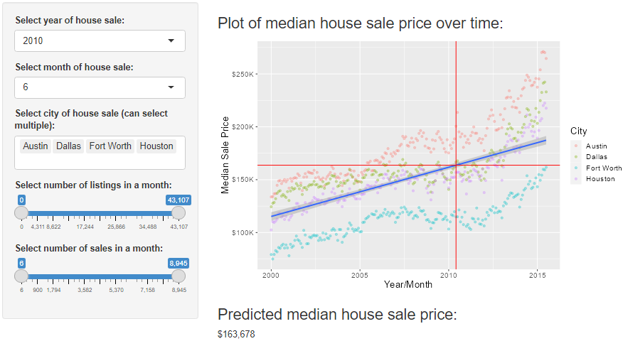

```{r setup, include=FALSE}
knitr::opts_chunk$set(echo = FALSE)
```

## Texas Housing Price Prediction

For the Developing Data Products Course Project on Coursera I developed a Shiny App that predicts median house sale for a given in month in Texas through the txhousing data set from ggplot2. 

A user can manipulate factors like the house's city, and the number of sales and listing in a month to determine the most cost effective time to buy a house for a given city and selection of cities. 

## txhousing Data

The txhousing data set used in the applicable is shown below. It consits of 9 variables and 8,602 records. The 1,434 records with missing listings or median sales price were dropped from the Shiny App. 

```{r, echo = TRUE}
library(ggplot2)
head(txhousing)
```

## Shiny App

A screen shot of the Texas housing Shiny App is displayed below. Users can manipulate the variables 'city', 'year', 'month', 'sales', 'median' and 'listings' in application.


{width=90%}

## Link to Application 

The Shiny App can be access through the following link:
<https://cooper-carpenter.shinyapps.io/TXHousingPricePrediction/>

The full GitHub repo can be accessed at:
<https://github.com/coopercarpenter/Data-Products-Course-Project>


